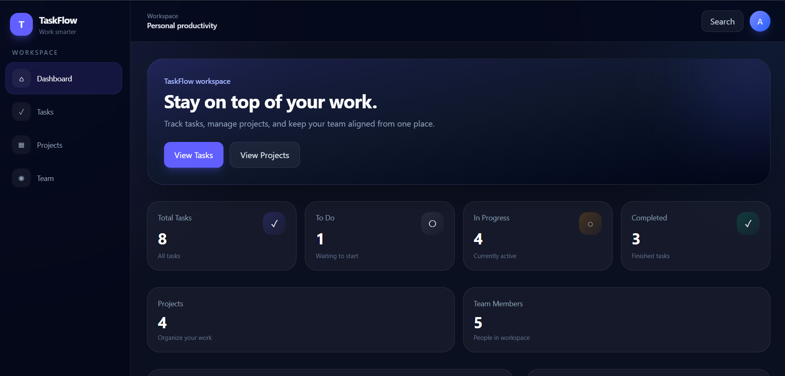
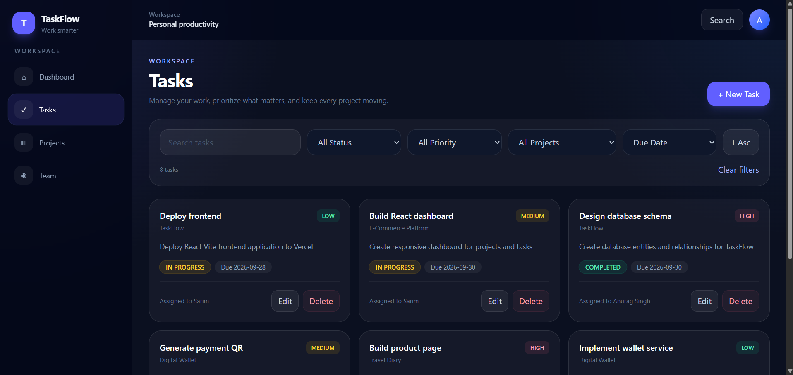
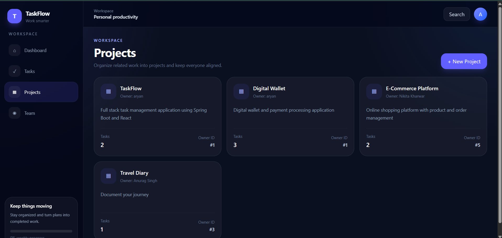
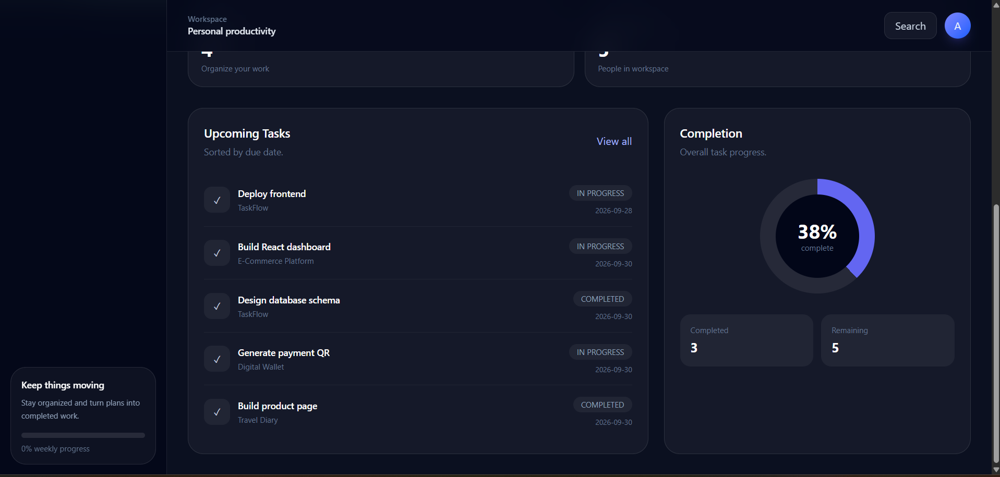
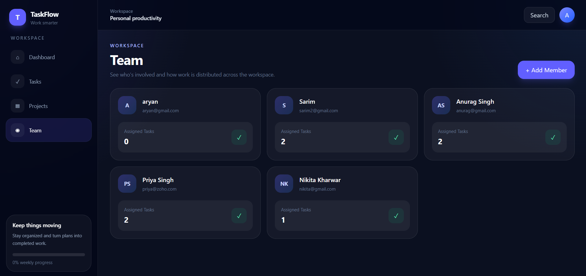
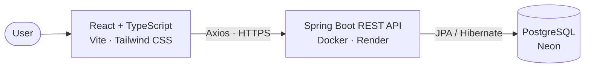
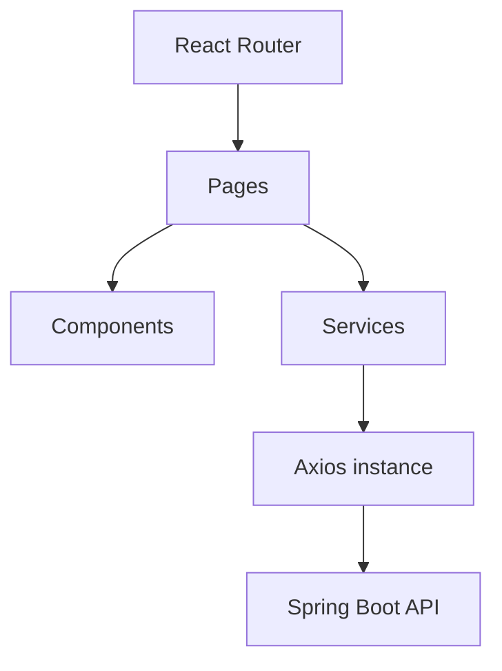
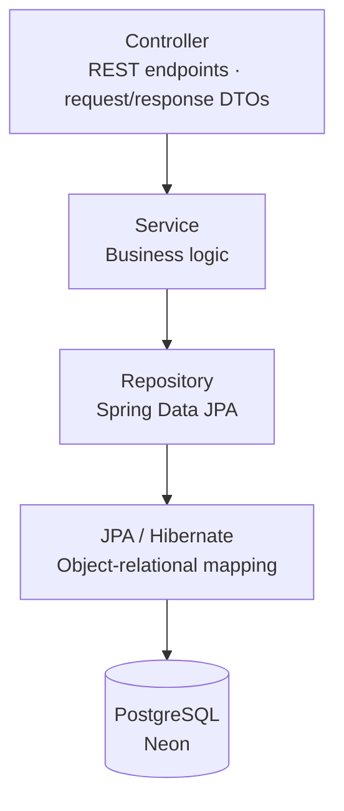
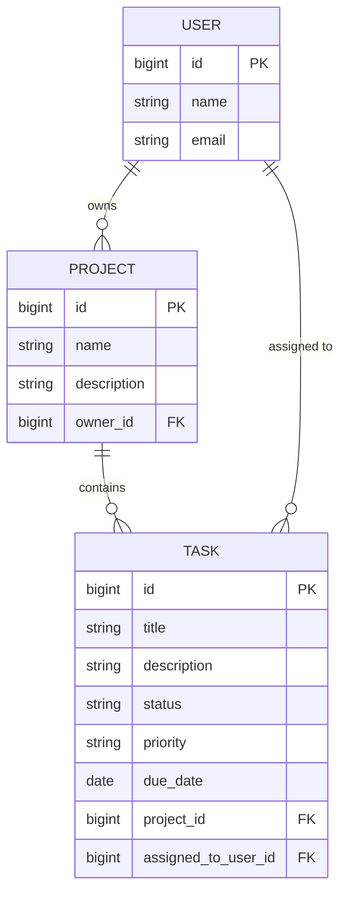
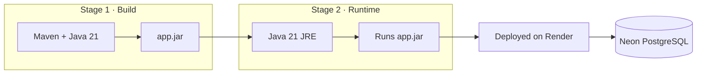

<div align="center">

#  TaskFlow

### A modern task management app — built full-stack with React and Spring Boot

Plan projects, assign work to your team, and track progress from one clean dark-mode dashboard.

<br/>

[](https://taskflow-frontend-xi-umber.vercel.app)
[](https://github.com/Aryan23b/taskflow-backend)


<br/>



</div>

---

## 📖 About

**TaskFlow** is a full-stack task management application. This repository contains the **React + TypeScript frontend**, which talks to a **Spring Boot REST API** backed by **PostgreSQL**.

It was built to demonstrate a complete frontend-to-backend workflow: CRUD operations, search, filtering, sorting, pagination, validation, error handling, and a responsive UI, all deployed to production.

| | Link |
|---|---|
|  **Live app** | [taskflow-frontend-xi-umber.vercel.app](https://taskflow-frontend-xi-umber.vercel.app) |
|  **Frontend repo** | [Aryan23b/taskflow-frontend](https://github.com/Aryan23b/taskflow-frontend) |
|  **Backend repo** | [Aryan23b/taskflow-backend](https://github.com/Aryan23b/taskflow-backend) |

---

##  Features

###  Dashboard
- At-a-glance stats for total, to-do, in-progress, and completed tasks, plus project and team counts
- **Upcoming tasks** list, sorted by due date
- **Completion ring** showing overall progress with completed vs. remaining counts

###  Tasks
- Create, edit, and delete tasks
- **Debounced search** so the API isn't hit on every keystroke
- Filter by **status**, **priority**, and **project**
- Sort by due date (ascending or descending) with a one-click **Clear filters**
- **Server-side pagination**
- Assign tasks to team members and set priority (Low / Medium / High)
- Status tracking: To Do → In Progress → Completed

###  Projects
- Create and manage projects
- Each project shows its owner and task count

###  Team
- Add and manage team members
- See how many tasks each member has been assigned

###  Experience
- Toast notifications and confirmation dialogs for destructive actions
- Form validation and centralized error handling
- Responsive, dark-mode-first UI

---

##  Screenshots

<table>
  <tr>
    <td align="center" width="50%">
      <b>Tasks</b><br/>
      
    </td>
    <td align="center" width="50%">
      <b>Projects</b><br/>
      
    </td>
  </tr>
  <tr>
    <td align="center" width="50%">
      <b>Dashboard insights</b><br/>
      
    </td>
    <td align="center" width="50%">
      <b>Team</b><br/>
      
    </td>
  </tr>
</table>

---

##  Architecture



### Inside the frontend



### Inside the backend

The Spring Boot API follows a classic layered architecture:



| Layer | Responsibility |
|---|---|
| **Controller** | Handles HTTP requests for `/api/users`, `/api/projects`, and `/api/tasks`, and delegates to the service layer. Never touches the database directly. |
| **Service** | Holds the business logic, keeping the code easy to maintain and test. |
| **Repository** | Spring Data JPA interfaces (`save`, `findById`, `findAll`, `deleteById`) with no hand-written SQL for basic operations. |
| **Entity / DTO** | JPA entities map to tables. DTOs shape API requests and responses, including a generic `PageResponse<T>` for paginated results. |
| **Exception handling** | Centralized handling that turns errors into consistent API responses. |

**Cross-cutting features:** request validation, pagination, Swagger/OpenAPI docs, Spring Boot Actuator (`/actuator/health`), and CORS configuration for the Vercel frontend.

#### Data model



A user owns many projects, a project contains many tasks, and each task can be assigned to a user.

#### Backend packages

```text
taskflow-backend/
├── controller/    # REST endpoints
├── service/       # Business logic
├── repository/    # Spring Data JPA repositories
├── entity/        # JPA entities
├── dto/           # Request/response objects, PageResponse<T>
├── enums/         # Task status and priority
├── exception/     # Centralized exception handling
└── resources/     # Configuration
```

#### Build and deployment



The multi-stage Docker build keeps Maven and the JDK out of the final image. Database credentials are supplied at runtime through environment variables (`SPRING_DATASOURCE_URL`, `SPRING_DATASOURCE_USERNAME`, `SPRING_DATASOURCE_PASSWORD`), never hard-coded.

### Who does what

| Frontend is responsible for | Backend is responsible for |
|---|---|
| UI and user interactions | Business logic |
| Routing | Validation |
| Client-side state | Database operations |
| Form handling | Entity relationships |
| API communication | Transactions |
| Loading and error states | API responses and exception handling |

This separation keeps both sides independently maintainable. The frontend never talks to the database directly.

---

##  Tech Stack

| Layer | Technologies |
|---|---|
| **Frontend** | React, TypeScript, Vite, Tailwind CSS, Axios, React Router |
| **Backend** | Java, Spring Boot, Spring Data JPA, Hibernate, REST API |
| **Database** | PostgreSQL on Neon |
| **Deployment** | Vercel (frontend), Render (backend), Neon (database) |
| **Tools** | VS Code, IntelliJ IDEA, Postman, Git, GitHub |

---

##  Project Structure

```text
taskflow-frontend/
└── src/
    ├── components/   # Reusable UI pieces
    ├── context/      # Shared React context
    ├── hooks/        # Custom hooks (e.g. debounced search)
    ├── layouts/      # App shell: sidebar + top bar
    ├── pages/        # Dashboard, Tasks, Projects, Team
    ├── services/     # API calls (taskService.ts, ...)
    ├── types/        # TypeScript interfaces
    └── utils/        # Helpers
```

The backend package structure is covered in the Architecture section above.

---

##  API Endpoints Used

| Resource | Method | Endpoint |
|---|---|---|
| **Users** | `POST` | `/api/users` |
| | `GET` | `/api/users` |
| | `GET` | `/api/users/{id}` |
| | `DELETE` | `/api/users/{id}` |
| **Projects** | `POST` | `/api/projects` |
| | `GET` | `/api/projects` |
| | `GET` | `/api/projects/{id}` |
| | `DELETE` | `/api/projects/{id}` |
| **Tasks** | `POST` | `/api/tasks` |
| | `GET` | `/api/tasks` |
| | `GET` | `/api/tasks/{id}` |
| | `PUT` | `/api/tasks/{id}` |
| | `DELETE` | `/api/tasks/{id}` |

### How a request flows

```text
Tasks page → taskService.ts → api.ts (Axios) → Spring Boot API → PostgreSQL
```

Example:

```http
GET /api/tasks?page=0&size=6&status=TODO
```

The backend returns paginated JSON. The frontend stores it in React state and renders the task cards.

---

##  Getting Started

### Prerequisites
- Node.js and npm
- Git
- The [TaskFlow backend](https://github.com/Aryan23b/taskflow-backend) running locally on `http://localhost:8080`

### 1. Clone the repo

```bash
git clone https://github.com/Aryan23b/taskflow-frontend.git
cd taskflow-frontend
```

### 2. Install dependencies

```bash
npm install
```

### 3. Configure environment variables

Create a `.env.local` file in the project root:

```env
VITE_API_BASE_URL=http://localhost:8080
```

### 4. Start the dev server

```bash
npm run dev
```

Open **http://localhost:5173**.

>  The backend must allow `http://localhost:5173` in its CORS configuration for the browser to reach the API.

---

## ☁️ Deployment

| Part | Platform | Notes |
|---|---|---|
| Frontend | **Vercel** | React + Vite build, API URL set through `VITE_API_BASE_URL` |
| Backend | **Render** | Spring Boot in a multi-stage Docker container |
| Database | **Neon** | Managed PostgreSQL (`users`, `projects`, `tasks`) |

---

##  Roadmap

- [ ] User authentication with JWT login
- [ ] Role-based authorization
- [ ] Task comments and attachments
- [ ] Activity history and notifications
- [ ] Light/dark theme switching
- [ ] Drag-and-drop Kanban board
- [ ] Advanced dashboard statistics
- [ ] Real-time updates with WebSockets

---

##  Author

**Aryan Baranwal**

[](https://github.com/Aryan23b)
[](https://www.linkedin.com/in/aryan-baranwal-75b9b129a/)

---

##  License

Created for learning, portfolio, and demonstration purposes.

<div align="center">

⭐ If you like this project, consider giving it a star!

</div>
